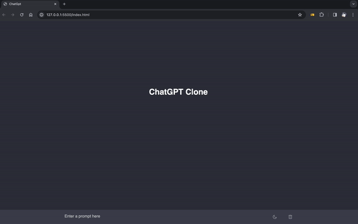

🚀 **Front-End Developer | ChatGPT Project**

Merhaba! Ben Salih, şu anda heyecan verici bir proje üzerinde çalışıyorum: **ChatGPT**. Bu proje, OpenAI'nin GPT-3.5 mimarisini kullanarak bir dil modeli ile etkileşimli bir sohbet arayüzü oluşturmayı amaçlamaktadır.

👨‍💻 **Teknolojiler:**
- HTML, CSS
- JavaScript (ES6+)
- OpenAI GPT-3.5

🌐 **Proje Tanımı:**
ChatGPT, kullanıcıların metin tabanlı bir arayüz aracılığıyla bir dil modeli ile etkileşime girmesini sağlar. Kullanıcılar, belirli bir metin girişi yaparak yapay zeka tabanlı cevaplar alabilirler. Proje, kullanıcı dostu bir arayüz tasarımını ve etkileyici bir sohbet deneyimini hedeflemektedir.

🎨 **UI/UX Tasarım:**
Proje, basit ve kullanıcı dostu bir arayüz ile tasarlanmıştır. Sohbet konteynerleri ve yazma alanı gibi öğeler, modern tasarım prensipleriyle birleştirilmiştir. Ayrıca, kullanıcıların temayı değiştirebilmeleri için temayı değiştirme özelliği eklenmiştir.

🚀 **Öne Çıkanlar:**
- HTML ve CSS ile modern tasarım uygulamaları
- JavaScript kullanarak etkileşimli web uygulamaları geliştirme
- OpenAI'nin güçlü GPT-3.5 dil modelini entegre etme

🌱 **Gelecek Adımlar:**
Proje üzerinde devam eden çalışmalarla, kullanıcı deneyimini geliştirmek ve yeni özellikler eklemek istiyorum. Ayrıca, daha fazla teknolojiyi projeye entegre etmeyi planlıyorum.

🌐 Katılım 🌐

Bu projeye katkıda bulunmak istiyorsanız, lütfen [avcisalihoffical@gmail.com] bana ulaşabilirsiniz veya github hesabımı takip edin.

🌐 Ekran Görüntüsü 🌐

